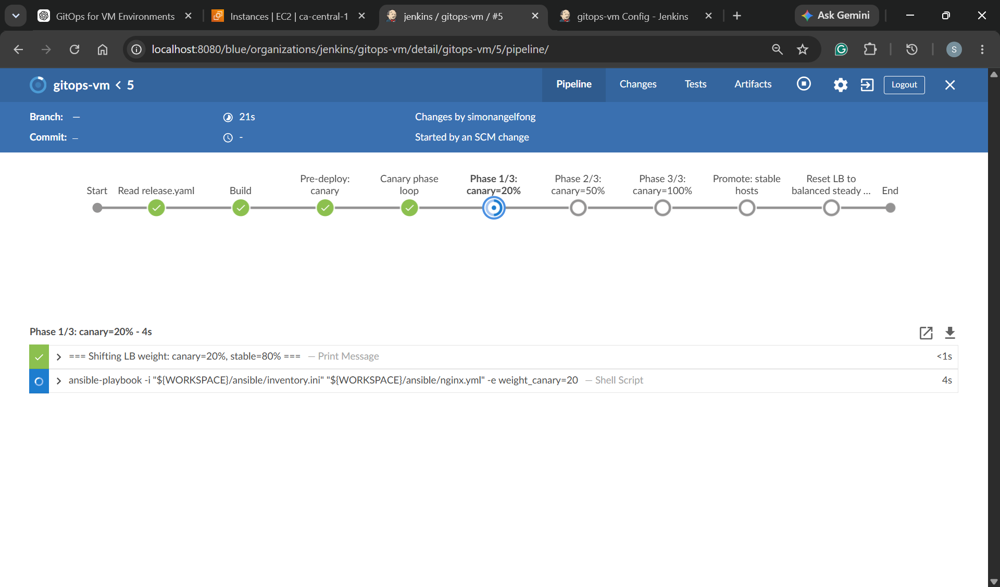
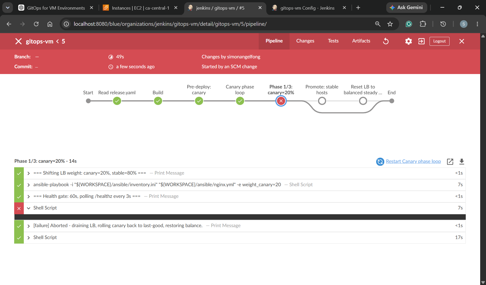

# Ansible Runbook: Implementing GitOps on VMs

     

- [Ansible Runbook: Implementing GitOps on VMs](#ansible-runbook-implementing-gitops-on-vms)
  - [Challenge](#challenge)
  - [VM-based Environment Architecture](#vm-based-environment-architecture)
  - [GitOps Pipeline](#gitops-pipeline)
    - [Happy Path](#happy-path)
    - [Alternative Path](#alternative-path)
  - [Detailed Documentation](#detailed-documentation)

---

## Challenge

`GitOps` practices enable progressive deployments, fast rollbacks, and improved reliability. However, many small and medium-sized companies still run applications in `VM-based environments` rather than cloud-native environments.

> How can a VM-based environment implement modern GitOps practices?

- **Project Goals**
  - Reproduce a VM-based application environment using `AWS EC2`
  - Implement `GitOps-style deployment` practices for a simple `Go REST API`
  - Use `Jenkins` and `Ansible` to automate deployment, configuration, and rollback workflows

**Note**: This project is designed as a `VM-based` counterpart to a `Kubernetes` + `ArgoCD` deployment model, demonstrating how similar GitOps principles can be applied outside `Kubernetes` environments.

---

## VM-based Environment Architecture

```txt
                            │
                            │ Public traffic
                            ▼
┌──────────────────────────────────────────────────────────────────┐
│ VPC: 10.0.0.0/16                                                 │
│                                                                  │
│  ┌────────────────────────────────────────────────────────────┐  │
│  │ DMZ Subnet: 10.0.10.0/24                                   │  │
│  │                                                            │  │
│  │  ┌──────────────────────────────────────────────────────┐  │  │
│  │  │ gitops-lb                                            │  │  │
│  │  │ 10.0.10.20                                           │  │  │
│  │  │ Nginx reverse proxy / traffic split                  │  │  │
│  │  │ Only internet-facing application host                │  │  │
│  │  └───────────────┬──────────────────────┬───────────────┘  │  │
│  └──────────────────│──────────────────────│──────────────────┘  │
│                     │                      │                     │
│                     │ HTTP :8080           │ HTTP :8080          │
│                     ▼                      ▼                     │
│  ┌────────────────────────────────────────────────────────────┐  │
│  │ App Subnet: 10.0.20.0/24                                   │  │
│  │                                                            │  │
│  │  ┌──────────────────────┐        ┌──────────────────────┐  │  │
│  │  │ gitops-app-vm1       │        │ gitops-app-vm2       │  │  │
│  │  │ 10.0.20.11           │        │ 10.0.20.12           │  │  │
│  │  │ Go API + systemd     │        │ Go API + systemd     │  │  │
│  │  │ Canary               │        │ Stable               │  │  │
│  │  └──────────┬───────────┘        └──────────┬───────────┘  │  │
│  └─────────────│───────────────────────────────│──────────────┘  │
│                │                               │                 │
│                │ SSH / Ansible                 │ SSH / Ansible   │
│                │ Metrics scrape                │ Metrics scrape  │
│                ▼                               ▼                 │
│  ┌────────────────────────────────────────────────────────────┐  │
│  │ Mgmt Subnet: 10.0.90.0/24                                  │  │
│  │                                                            │  │
│  │  ┌──────────────────────┐        ┌──────────────────────┐  │  │
│  │  │ gitops-jump          │        │ gitops-monitor       │  │  │
│  │  │ 10.0.90.10           │        │ 10.0.90.20           │  │  │
│  │  │ Jenkins              │        │ Prometheus           │  │  │
│  │  │ Ansible              │        │ Grafana              │  │  │
│  │  │ Jump host            │        │ Metrics dashboard    │  │  │
│  │  └──────────────────────┘        └──────────────────────┘  │  │
│  └────────────────────────────────────────────────────────────┘  │
│                                                                  │
└──────────────────────────────────────────────────────────────────┘
```

---

## GitOps Pipeline

### Happy Path

- **Trigger**: `Jenkins PollSCM` per 2 minutes
- **Steps**:
  1. Read `release.yaml`
     - Parse the declared state into environment variables.
  2. Build
     - Build the `Go` artifact based on the environment variables.
  3. Pre-deploy Canary
     - Deploy the canary version to the canary instance.
     - Run:
       ```sh
       ansible-playbook deploy.yml --limit app-vm1
       ```
  4. Canary Phase Loop
     - Shift traffic progressively: 20% for 60s → 50% for 60s → 100%
     - Split weighted traffic using Nginx.
     - Run health checks against `/healthz`.
  5. Promote to Stable Hosts
     - Deploy the canary version to the stable instance.
  6. Reset Load Balancer
     - Restore the Nginx traffic weights to the balanced state.

---

- **Jenkins**


- **Grafana Dashboard**


---

### Alternative Path

- **Trigger**: Health check failure while rolling out.
- **Steps**:
  1. Drain Load Balancer
     - Set canary traffic to `0`.
  2. Rollback Canary
     - Switch the symlink back to the previous release and restart the service.
  3. Restore Balance
     - Restore the Nginx traffic weights to the balanced state.
  4. GitOps Revert Workflow
     - Revert git version
     - Trigger previous stable deployment.

---

- **Jenkins**





- **Grafana Dashboard**


---

## Detailed Documentation

- [Step 1: Provision `AWS EC2` via `Terraform`](./docs/01_infra.md)
- [Step 2: Bootstrap VMs-based environemnt via `Ansible`](./docs/02_bootstrap.md)
- [Step 3: Create CI/CD via `Jenkins`](./docs/03_jenkins.md)
- [Step 4: Enable monitoring via `Prometheus` + `Grafana`](./docs/04_monitor.md)
- [Step 5: Happy path testing](./docs/05_test_happy.md)
- [Step 6: Alternative path testing](./docs/06_test_alternative.md)
